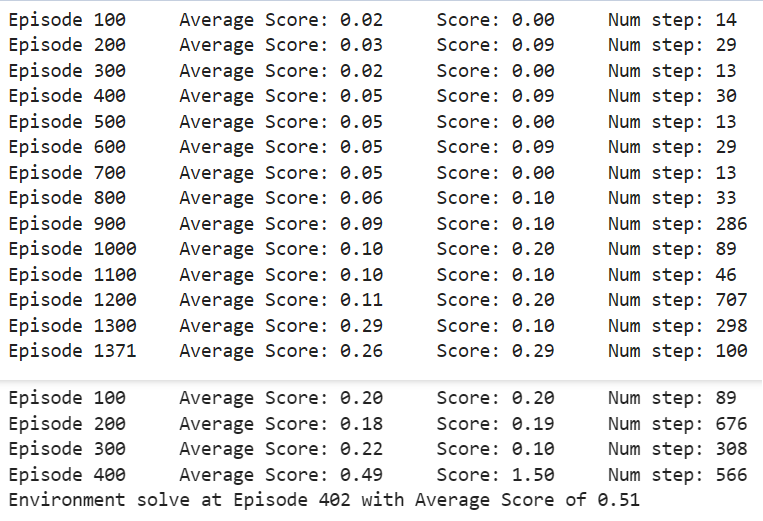

# DRL_P3_Cooperation_Competition

[//]: # (Image References)

[image1]: https://user-images.githubusercontent.com/10624937/42135623-e770e354-7d12-11e8-998d-29fc74429ca2.gif "Trained Agent"


## 1 Introduction

The goal of this project is to train two agents to control the rackets to bounce a ball over a net. as showed in the following image:  

![Trained Agent][image1]

If an agent hits the ball over the net, it receives a reward of +0.1.  If an agent lets a ball hit the ground or hits the ball out of bounds, it receives a reward of -0.01.  Thus, the goal of each agent is to keep the ball in play.

The observation space consists of 8 variables corresponding to the position and velocity of the ball and racket. Each agent receives its own, local observation.  Two continuous actions are available, corresponding to movement toward (or away from) the net, and jumping. 

The task is episodic, and in order to solve the environment, the agents must get an average score of +0.5 (over 100 consecutive episodes, after taking the maximum over both agents). Specifically,

- After each episode, we add up the rewards that each agent received (without discounting), to get a score for each agent. This yields 2 (potentially different) scores. We then take the maximum of these 2 scores.
- This yields a single **score** for each episode.

The environment is considered solved, when the average (over 100 episodes) of those **scores** is at least +0.5.

## 2 Algorithm Implementation

### 2.1 Multi-Agent with Deep Deterministic Policy Gradient (DDPG)

In this task, **DDPG** has been selected as the basic algorithm for each agent, which is an advanced reinforcement learning algorithm that is particularly well-suited for continuous action spaces. It combines ideas from both policy gradient methods and value-based methods to learn policies that can handle high-dimensional action spaces effectively.

DDPG uses an **actor-critic** architecture, where the actor is responsible for selecting actions based on the current policy, and the critic evaluates the actions taken by the actor by estimating the action-value function (Q-value).

It employs **target networks** for both the actor and the critic. These target networks are updated slowly (using soft updates) to stabilize learning. The target networks are used to compute the target Q-values, which helps in reducing variance in the updates.

The neural networks are implemented in the `model.py` file which can be found [here](https://github.com/yijun-deng/DRL_P3_MultiAgent_Tennis/blob/main/model.py#L5). The following figures shows the structure of the 2 neural networks (actor and critic) respectively:


As the 2 agents need to cooperate with each other to gain maximum rewards, a special approach with **centralized training** and **de-centralized execution** has been implemented, which means that each agent has its own actor network to select actions and the 2 agents share the same critic network to evaluate the state-action pair. This Multi-Agent DDPG algorithm has been implemented in the `ddpg_agent.ipynb` file which can be found [here](https://github.com/yijun-deng/DRL_P3_MultiAgent_Tennis/blob/main/ddpg_agent.py#L5).

### 2.2 Exploration and Exploitation

The OUNoise is added to the actions to balance the trade-off between exploration (trying new actions to discover their effects) and exploitation (choosing best actions based on current knowledge).

To make the learning more efficient, a decayed epsilon has been used, which means that the value of epsilon is not fixed but rather decreases over time. This decay allows the agent to explore more in the early stages of training when it has less knowledge about the environment and gradually shift towards exploiting its learned knowledge as training progresses. The values of decayed epsilon are as below:
```python
eps_start=1.0, eps_decay=0.99992
```
Where eps_start is the initial value of epsilon, eps_decay is its decay rate and eps_end is its minimun value.

## 3 Result

The bolow figure shows the final result of the training. The workspace disconnected after running **1371 Episodes**, and another training session has continued starting from the saved checkpoint model at episode 1300. And the agent was able to solve the evironment within **402** episodes at the second training session with an average score of **0.51**. So the total number of training episode was **1300 + 402 = 1702 episodes**.



Due to a small error in the codes, the score history has not been saved, therefore, only the averaged score has been plotted in the following figure:


## 4 Future Improvements

Even though DDPG is powerful enough to solve this task, we could still try other algorithms like PPO, SAC, etc., which could perform better than DDPG due to their ability to handle multi-agent interactions more effectively.

